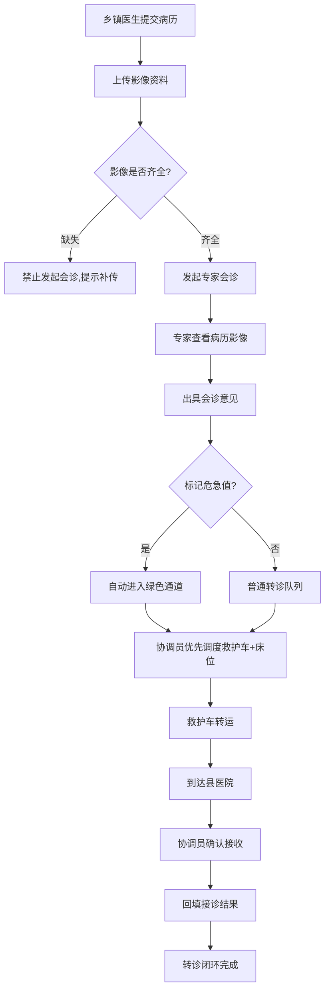

# 山区远程会诊转诊系统 - 产品需求文档（PRD）

## 1. 产品概述

山区远程会诊转诊系统面向乡镇卫生院、县级医院与转运协调中心，打通"病历影像提交 → 专家远程会诊 → 救护车转运 → 床位接收 → 接诊结果回填"的闭环链路，解决山区患者因地理与医疗资源分布不均导致的会诊难、转运慢、结果不透明问题，并通过危急值绿色通道机制缩短危重患者救治时间。

- **目标用户**：乡镇医生、县医院专家、转运协调员
- **核心价值**：让偏远乡镇患者在数小时内获得县级专家会诊意见与转运接收，危急值病例自动优先调度

## 2. 核心功能

### 2.1 用户角色

| 角色 | 录入方式 | 核心权限 |
|------|----------|----------|
| 乡镇医生 | 管理员分配账号 | 提交病历与影像、查看会诊意见、发起转诊、回填接诊结果 |
| 县医院专家 | 管理员分配账号 | 查看待会诊病历与影像、出具会诊意见、标记危急值 |
| 转运协调员 | 管理员分配账号 | 调度救护车、分配接收床位、跟踪转运状态、确认接收 |
| 系统管理员 | 预置账号 | 机构/用户/床位/救护车档案管理 |

### 2.2 功能模块

1. **工作台**：角色化任务看板，统计概览与待办列表
2. **病历管理**：乡镇医生录入患者病历与生命体征
3. **影像管理**：上传/查看影像资料并建立索引（X光/CT/MRI/超声）
4. **会诊管理**：专家查看病历影像并出具会诊意见
5. **转运管理**：协调员调度救护车与床位，跟踪转运
6. **床位管理**：床位状态看板与分配
7. **绿色通道**：危急值病例自动优先调度面板
8. **接诊结果回填**：转诊完成后回填接诊诊断与处置

### 2.3 页面详情

| 页面名称 | 模块名称 | 功能描述 |
|----------|----------|----------|
| 登录页 | 账号登录 | 账号密码登录，按角色跳转工作台 |
| 工作台 | 任务看板 | 待办数量卡片、近期待办列表、统计图表 |
| 工作台 | 统计概览 | 会诊完成率、转运平均时长、绿色通道激活数 |
| 病历管理 | 病历列表 | 按状态/危急值筛选，查看病历详情 |
| 病历管理 | 病历录入 | 患者信息、主诉、病史、生命体征、危急值标记 |
| 影像管理 | 影像列表 | 按病历查看影像缩略，上传新影像 |
| 影像管理 | 影像上传 | 选择影像类型与文件上传 |
| 会诊管理 | 待会诊列表 | 影像齐全的待会诊病历，进入会诊 |
| 会诊管理 | 会诊详情 | 查看病历+影像，填写会诊意见、诊断、建议、是否危急值 |
| 转运管理 | 转运列表 | 转运单状态跟踪（待派车/转运中/已到达/已接收） |
| 转运管理 | 派车与床位 | 选择救护车与接收床位，发起转运 |
| 床位管理 | 床位看板 | 按科室展示床位占用/空闲，分配床位 |
| 绿色通道 | 通道面板 | 自动纳入的危急值病例，优先调度入口 |
| 接诊结果 | 结果回填 | 录入接诊诊断、处置、结局，关闭转诊闭环 |

## 3. 核心流程

乡镇医生提交病历与影像后，系统校验影像是否齐全：影像缺失则禁止发起专家会诊。专家会诊时可标记危急值，标记后病例自动进入绿色通道并通知协调员优先调度救护车与床位。协调员安排转运后跟踪到达与接收，县医院接收后由乡镇医生或专家回填接诊结果，完成转诊闭环。

## 4. 用户界面设计

### 4.1 设计风格

- **主色调**：医疗青蓝 `#0E7C7B`（沉稳、可信赖），辅以 `#2BB3A3` 浅青作为强调
- **危急色**：`#E5484D`（红色，用于危急值与绿色通道告警）
- **成功色**：`#30A46C`（绿色，用于完成状态）
- **按钮风格**：Ant Design 圆角按钮，主操作使用主色填充，次操作描边
- **字体**：标题使用 `Noto Serif SC` 衬线体体现专业稳重，正文使用 `Inter`/系统默认无衬线保证可读性
- **布局风格**：顶部导航 + 左侧菜单 + 卡片式内容区，数据看板采用网格卡片
- **图标**：使用 Ant Design 内置图标，统一线性风格

### 4.2 页面设计概览

| 页面名称 | 模块名称 | UI 元素 |
|----------|----------|----------|
| 登录页 | 登录卡片 | 居中卡片,青蓝渐变背景,表单,角色提示 |
| 工作台 | 任务卡片 | 4列统计卡片,数字大号,图标,趋势色 |
| 工作台 | 待办列表 | 表格,状态标签,危急值红色高亮 |
| 病历录入 | 录入表单 | 分步表单,生命体征输入,危急值开关 |
| 会诊详情 | 双栏布局 | 左侧病历+影像预览,右侧会诊意见表单 |
| 转运列表 | 状态时间线 | Steps步骤条,地图占位,状态标签 |
| 床位看板 | 床位网格 | 按科室分组,色块表示空闲/占用/清洁中 |
| 绿色通道 | 告警面板 | 红色边框卡片,倒计时,优先操作按钮 |

### 4.3 响应式

- 桌面优先（1280px+），适配县医院与乡镇卫生院 PC 工作站
- 平板自适应（768px-1280px），菜单可折叠
- 关键操作按钮保持触摸友好尺寸

### 4.4 3D 场景说明

本项目为业务管理系统，不涉及 3D 场景。
