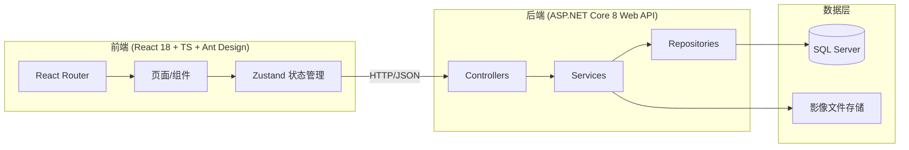
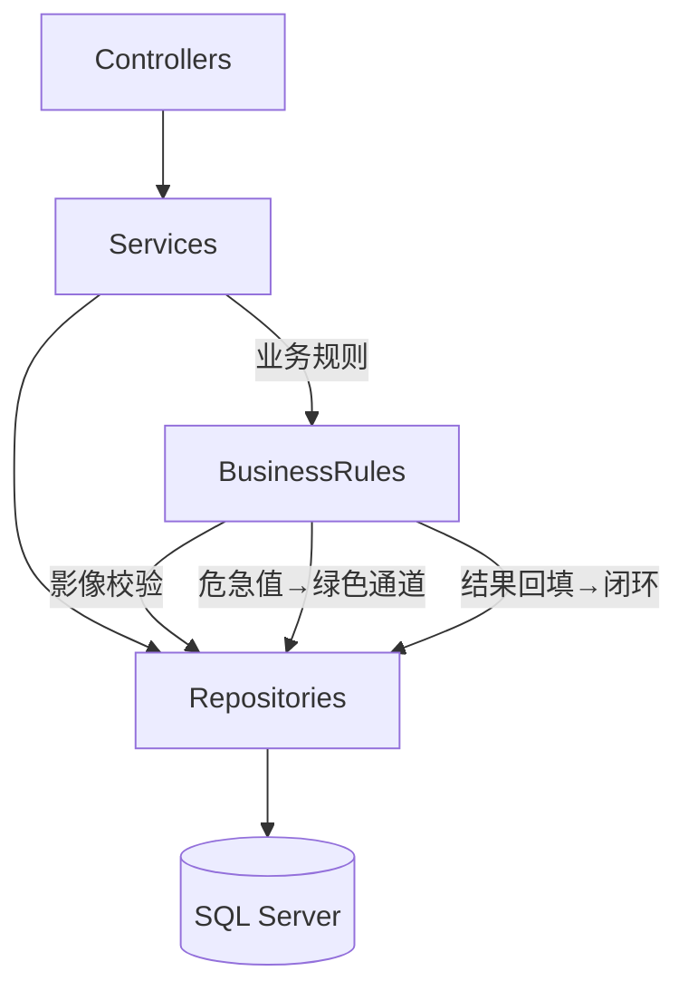
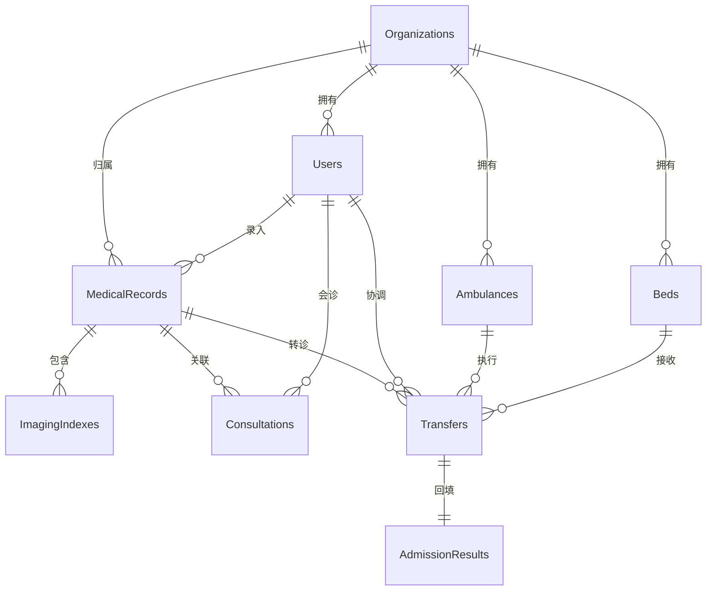

# 山区远程会诊转诊系统 - 技术架构文档

## 1. 架构设计



## 2. 技术说明

- **前端**：React@18 + TypeScript + Ant Design@5 + Vite + React Router + Zustand
- **初始化工具**：vite-init（react-ts 模板），随后追加 Ant Design 依赖
- **后端**：ASP.NET Core 8 Web API（C#， Controllers + Services + Repositories 分层）
- **数据库**：SQL Server（病历、影像索引、会诊、转运、床位记录）
- **文件存储**：影像文件存储于本地磁盘目录，数据库仅存索引与路径

## 3. 路由定义

| 路由 | 用途 |
|------|------|
| `/login` | 登录页 |
| `/` | 工作台（角色化看板） |
| `/records` | 病历列表 |
| `/records/new` | 病历录入 |
| `/records/:id` | 病历详情（含影像） |
| `/consultations` | 会诊列表 |
| `/consultations/:id` | 会诊详情 |
| `/transfers` | 转运列表 |
| `/transfers/:id` | 转运详情（派车/床位） |
| `/beds` | 床位看板 |
| `/green-channel` | 绿色通道面板 |
| `/admissions` | 接诊结果回填列表 |
| `/admissions/:id` | 接诊结果回填表单 |

## 4. API 定义

### 4.1 认证

```typescript
// POST /api/auth/login
interface LoginRequest { username: string; password: string }
interface LoginResponse { token: string; user: User }
interface User {
  id: string; name: string; role: 'doctor' | 'expert' | 'coordinator' | 'admin';
  orgId: string; orgName: string;
}
```

### 4.2 病历与影像

```typescript
// GET /api/records?status=&critical=&page=&size=
interface MedicalRecord {
  id: string; patientName: string; patientAge: number; patientGender: string;
  chiefComplaint: string; history: string; temperature?: number; heartRate?: number;
  bloodPressure?: string; spo2?: number; isCritical: boolean; greenChannel: boolean;
  status: 'draft' | 'pending_consult' | 'consulting' | 'transferring' | 'received' | 'closed';
  doctorId: string; doctorName: string; orgId: string; orgName: string;
  imagingComplete: boolean; createdAt: string;
}

// POST /api/records
interface CreateRecordRequest { patientName: string; patientAge: number; patientGender: string;
  chiefComplaint: string; history: string; temperature?: number; heartRate?: number;
  bloodPressure?: string; spo2?: number; isCritical: boolean; }

// GET /api/records/{id}/images
interface ImagingIndex {
  id: string; recordId: string; type: 'XRay' | 'CT' | 'MRI' | 'Ultrasound';
  fileName: string; filePath: string; uploadedAt: string;
}

// POST /api/records/{id}/images  (multipart/form-data)
// DELETE /api/images/{id}

// POST /api/records/{id}/request-consult  发起会诊(校验影像齐全)
interface RequestConsultResponse { consultationId: string; }
```

### 4.3 会诊

```typescript
// GET /api/consultations?status=
interface Consultation {
  id: string; recordId: string; expertId?: string; expertName?: string;
  opinion: string; diagnosis: string; recommendation: string;
  isCritical: boolean; status: 'pending' | 'completed';
  createdAt: string; completedAt?: string;
}

// POST /api/consultations/{id}/complete  专家提交会诊意见
interface CompleteConsultRequest {
  opinion: string; diagnosis: string; recommendation: string; isCritical: boolean;
}
```

### 4.4 转运与床位

```typescript
// GET /api/transfers?status=
interface Transfer {
  id: string; recordId: string; coordinatorId: string; coordinatorName: string;
  ambulanceId?: string; ambulancePlate?: string; bedId?: string; bedNumber?: string;
  status: 'pending_dispatch' | 'dispatched' | 'in_transit' | 'arrived' | 'received' | 'closed';
  departureTime?: string; arrivalTime?: string; createdAt: string;
}

// POST /api/transfers  创建转运单(派车+床位)
interface CreateTransferRequest { recordId: string; ambulanceId: string; bedId: string; }

// PATCH /api/transfers/{id}/status  更新转运状态
interface UpdateStatusRequest { status: string; }

// GET /api/beds?status=
interface Bed {
  id: string; bedNumber: string; department: string;
  status: 'available' | 'occupied' | 'cleaning'; orgId: string;
}

// GET /api/ambulances?status=
interface Ambulance {
  id: string; plateNumber: string; driver: string;
  status: 'idle' | 'on_mission'; orgId: string;
}
```

### 4.5 接诊结果回填

```typescript
// POST /api/admissions  回填接诊结果
interface AdmissionResult {
  id: string; transferId: string; recordId: string;
  admissionDiagnosis: string; treatment: string;
  outcome: 'admitted' | 'transferred_icu' | 'discharged' | 'deceased';
  receivedBy: string; receivedAt: string;
}
```

## 5. 服务端架构图



分层职责：
- **Controllers**：接收 HTTP 请求，参数校验，返回结果
- **Services**：业务逻辑编排，如会诊发起前的影像完整性校验、危急值自动入绿色通道、转运状态流转
- **Repositories**：数据访问，封装 EF Core 或 Dapper 查询
- **BusinessRules**：集中式业务规则校验，确保影像缺失禁止会诊、危急值自动流转等约束

## 6. 数据模型

### 6.1 数据模型定义



### 6.2 数据定义语言（DDL）

```sql
-- 机构表
CREATE TABLE Organizations (
    Id UNIQUEIDENTIFIER PRIMARY KEY DEFAULT NEWID(),
    Name NVARCHAR(100) NOT NULL,
    Type NVARCHAR(20) NOT NULL,           -- township / county
    Level INT NOT NULL DEFAULT 0,
    ParentId UNIQUEIDENTIFIER NULL,
    CreatedAt DATETIME2 NOT NULL DEFAULT SYSUTCDATETIME()
);

-- 用户表
CREATE TABLE Users (
    Id UNIQUEIDENTIFIER PRIMARY KEY DEFAULT NEWID(),
    Username NVARCHAR(50) NOT NULL UNIQUE,
    PasswordHash NVARCHAR(256) NOT NULL,
    Name NVARCHAR(50) NOT NULL,
    Role NVARCHAR(20) NOT NULL,           -- doctor / expert / coordinator / admin
    OrgId UNIQUEIDENTIFIER NOT NULL,
    Phone NVARCHAR(20) NULL,
    CreatedAt DATETIME2 NOT NULL DEFAULT SYSUTCDATETIME(),
    CONSTRAINT FK_Users_Org FOREIGN KEY (OrgId) REFERENCES Organizations(Id)
);

-- 病历表
CREATE TABLE MedicalRecords (
    Id UNIQUEIDENTIFIER PRIMARY KEY DEFAULT NEWID(),
    PatientName NVARCHAR(50) NOT NULL,
    PatientAge INT NOT NULL,
    PatientGender NVARCHAR(10) NOT NULL,
    ChiefComplaint NVARCHAR(500) NOT NULL,
    History NVARCHAR(2000) NULL,
    Temperature DECIMAL(4,1) NULL,
    HeartRate INT NULL,
    BloodPressure NVARCHAR(20) NULL,
    SpO2 INT NULL,
    IsCritical BIT NOT NULL DEFAULT 0,
    GreenChannel BIT NOT NULL DEFAULT 0,
    Status NVARCHAR(20) NOT NULL DEFAULT 'draft',
    DoctorId UNIQUEIDENTIFIER NOT NULL,
    OrgId UNIQUEIDENTIFIER NOT NULL,
    ImagingComplete BIT NOT NULL DEFAULT 0,
    CreatedAt DATETIME2 NOT NULL DEFAULT SYSUTCDATETIME(),
    CONSTRAINT FK_Records_Doctor FOREIGN KEY (DoctorId) REFERENCES Users(Id),
    CONSTRAINT FK_Records_Org FOREIGN KEY (OrgId) REFERENCES Organizations(Id)
);

-- 影像索引表
CREATE TABLE ImagingIndexes (
    Id UNIQUEIDENTIFIER PRIMARY KEY DEFAULT NEWID(),
    RecordId UNIQUEIDENTIFIER NOT NULL,
    Type NVARCHAR(20) NOT NULL,           -- XRay / CT / MRI / Ultrasound
    FileName NVARCHAR(200) NOT NULL,
    FilePath NVARCHAR(500) NOT NULL,
    UploadedAt DATETIME2 NOT NULL DEFAULT SYSUTCDATETIME(),
    CONSTRAINT FK_Images_Record FOREIGN KEY (RecordId) REFERENCES MedicalRecords(Id) ON DELETE CASCADE
);

-- 会诊表
CREATE TABLE Consultations (
    Id UNIQUEIDENTIFIER PRIMARY KEY DEFAULT NEWID(),
    RecordId UNIQUEIDENTIFIER NOT NULL,
    ExpertId UNIQUEIDENTIFIER NULL,
    Opinion NVARCHAR(2000) NULL,
    Diagnosis NVARCHAR(500) NULL,
    Recommendation NVARCHAR(1000) NULL,
    IsCritical BIT NOT NULL DEFAULT 0,
    Status NVARCHAR(20) NOT NULL DEFAULT 'pending',
    CreatedAt DATETIME2 NOT NULL DEFAULT SYSUTCDATETIME(),
    CompletedAt DATETIME2 NULL,
    CONSTRAINT FK_Consult_Record FOREIGN KEY (RecordId) REFERENCES MedicalRecords(Id),
    CONSTRAINT FK_Consult_Expert FOREIGN KEY (ExpertId) REFERENCES Users(Id)
);

-- 救护车表
CREATE TABLE Ambulances (
    Id UNIQUEIDENTIFIER PRIMARY KEY DEFAULT NEWID(),
    PlateNumber NVARCHAR(20) NOT NULL,
    Driver NVARCHAR(50) NOT NULL,
    Status NVARCHAR(20) NOT NULL DEFAULT 'idle',
    OrgId UNIQUEIDENTIFIER NOT NULL,
    CONSTRAINT FK_Amb_Org FOREIGN KEY (OrgId) REFERENCES Organizations(Id)
);

-- 床位表
CREATE TABLE Beds (
    Id UNIQUEIDENTIFIER PRIMARY KEY DEFAULT NEWID(),
    BedNumber NVARCHAR(20) NOT NULL,
    Department NVARCHAR(50) NOT NULL,
    Status NVARCHAR(20) NOT NULL DEFAULT 'available',
    OrgId UNIQUEIDENTIFIER NOT NULL,
    CONSTRAINT FK_Bed_Org FOREIGN KEY (OrgId) REFERENCES Organizations(Id)
);

-- 转运表
CREATE TABLE Transfers (
    Id UNIQUEIDENTIFIER PRIMARY KEY DEFAULT NEWID(),
    RecordId UNIQUEIDENTIFIER NOT NULL,
    CoordinatorId UNIQUEIDENTIFIER NOT NULL,
    AmbulanceId UNIQUEIDENTIFIER NULL,
    BedId UNIQUEIDENTIFIER NULL,
    Status NVARCHAR(20) NOT NULL DEFAULT 'pending_dispatch',
    DepartureTime DATETIME2 NULL,
    ArrivalTime DATETIME2 NULL,
    CreatedAt DATETIME2 NOT NULL DEFAULT SYSUTCDATETIME(),
    CONSTRAINT FK_Transfer_Record FOREIGN KEY (RecordId) REFERENCES MedicalRecords(Id),
    CONSTRAINT FK_Transfer_Coord FOREIGN KEY (CoordinatorId) REFERENCES Users(Id),
    CONSTRAINT FK_Transfer_Amb FOREIGN KEY (AmbulanceId) REFERENCES Ambulances(Id),
    CONSTRAINT FK_Transfer_Bed FOREIGN KEY (BedId) REFERENCES Beds(Id)
);

-- 接诊结果表
CREATE TABLE AdmissionResults (
    Id UNIQUEIDENTIFIER PRIMARY KEY DEFAULT NEWID(),
    TransferId UNIQUEIDENTIFIER NOT NULL,
    RecordId UNIQUEIDENTIFIER NOT NULL,
    AdmissionDiagnosis NVARCHAR(500) NOT NULL,
    Treatment NVARCHAR(2000) NULL,
    Outcome NVARCHAR(20) NOT NULL,        -- admitted / transferred_icu / discharged / deceased
    ReceivedBy UNIQUEIDENTIFIER NOT NULL,
    ReceivedAt DATETIME2 NOT NULL DEFAULT SYSUTCDATETIME(),
    CONSTRAINT FK_Admit_Transfer FOREIGN KEY (TransferId) REFERENCES Transfers(Id),
    CONSTRAINT FK_Admit_Record FOREIGN KEY (RecordId) REFERENCES MedicalRecords(Id),
    CONSTRAINT FK_Admit_User FOREIGN KEY (ReceivedBy) REFERENCES Users(Id)
);

-- 索引
CREATE INDEX IX_Records_Status ON MedicalRecords(Status);
CREATE INDEX IX_Records_Critical ON MedicalRecords(IsCritical);
CREATE INDEX IX_Records_GreenChannel ON MedicalRecords(GreenChannel);
CREATE INDEX IX_Images_RecordId ON ImagingIndexes(RecordId);
CREATE INDEX IX_Consult_RecordId ON Consultations(RecordId);
CREATE INDEX IX_Consult_Status ON Consultations(Status);
CREATE INDEX IX_Transfer_Status ON Transfers(Status);
CREATE INDEX IX_Transfer_RecordId ON Transfers(RecordId);
CREATE INDEX IX_Beds_Status ON Beds(Status);
CREATE INDEX IX_Ambulances_Status ON Ambulances(Status);

-- 初始数据：机构
INSERT INTO Organizations (Id, Name, Type, Level) VALUES
(NEWID(), N'青石乡卫生院', N'township', 1),
(NEWID(), N'云岭县人民医院', N'county', 2);

-- 初始数据：床位（县医院）
INSERT INTO Beds (Id, BedNumber, Department, Status, OrgId)
SELECT NEWID(), N'急诊-01', N'急诊科', N'available', o.Id FROM Organizations o WHERE o.Name = N'云岭县人民医院';
INSERT INTO Beds (Id, BedNumber, Department, Status, OrgId)
SELECT NEWID(), N'急诊-02', N'急诊科', N'available', o.Id FROM Organizations o WHERE o.Name = N'云岭县人民医院';
INSERT INTO Beds (Id, BedNumber, Department, Status, OrgId)
SELECT NEWID(), N'心内-05', N'心内科', N'occupied', o.Id FROM Organizations o WHERE o.Name = N'云岭县人民医院';
INSERT INTO Beds (Id, BedNumber, Department, Status, OrgId)
SELECT NEWID(), N'ICU-01', N'重症监护', N'available', o.Id FROM Organizations o WHERE o.Name = N'云岭县人民医院';

-- 初始数据：救护车
INSERT INTO Ambulances (Id, PlateNumber, Driver, Status, OrgId)
SELECT NEWID(), N'云A-12001', N'张师傅', N'idle', o.Id FROM Organizations o WHERE o.Name = N'云岭县人民医院';
INSERT INTO Ambulances (Id, PlateNumber, Driver, Status, OrgId)
SELECT NEWID(), N'云A-12002', N'李师傅', N'idle', o.Id FROM Organizations o WHERE o.Name = N'云岭县人民医院';

-- 初始数据：用户（密码均为 123456 的哈希占位）
INSERT INTO Users (Id, Username, PasswordHash, Name, Role, OrgId, Phone)
SELECT NEWID(), N'doctor1', N'hash_doctor1', N'王乡镇医生', N'doctor', o.Id, N'13800000001'
FROM Organizations o WHERE o.Name = N'青石乡卫生院';
INSERT INTO Users (Id, Username, PasswordHash, Name, Role, OrgId, Phone)
SELECT NEWID(), N'expert1', N'hash_expert1', N'陈县医院专家', N'expert', o.Id, N'13800000002'
FROM Organizations o WHERE o.Name = N'云岭县人民医院';
INSERT INTO Users (Id, Username, PasswordHash, Name, Role, OrgId, Phone)
SELECT NEWID(), N'coord1', N'hash_coord1', N'刘转运协调员', N'coordinator', o.Id, N'13800000003'
FROM Organizations o WHERE o.Name = N'云岭县人民医院';
INSERT INTO Users (Id, Username, PasswordHash, Name, Role, OrgId, Phone)
SELECT NEWID(), N'admin1', N'hash_admin1', N'系统管理员', N'admin', o.Id, N'13800000004'
FROM Organizations o WHERE o.Name = N'云岭县人民医院';
```

### 6.3 业务规则约束说明

1. **影像缺失禁止会诊**：发起会诊时 `MedicalRecords.ImagingComplete = 0` 则拒绝，需先上传至少 1 张影像
2. **危急值自动绿色通道**：专家会诊提交 `IsCritical = 1` 时，系统自动将 `MedicalRecords.GreenChannel = 1` 并置为高优先级，触发转运提醒
3. **接诊结果回填闭环**：转运 `Status = received` 后方可回填 `AdmissionResults`，回填后病历 `Status = closed`，释放床位占用
